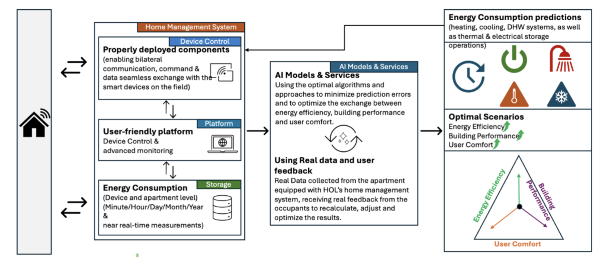
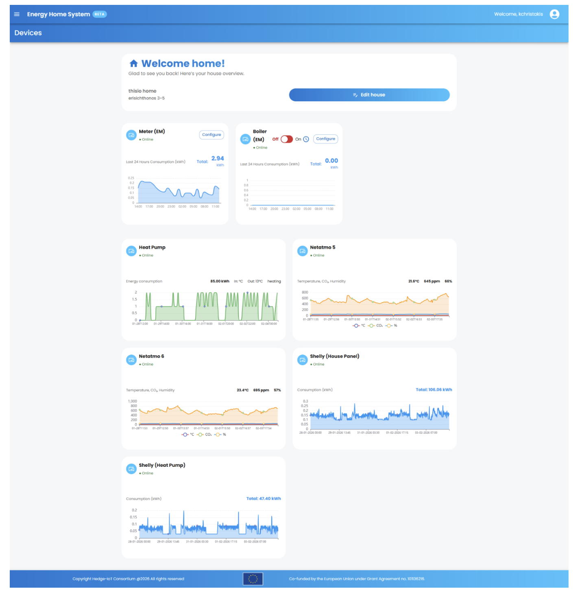
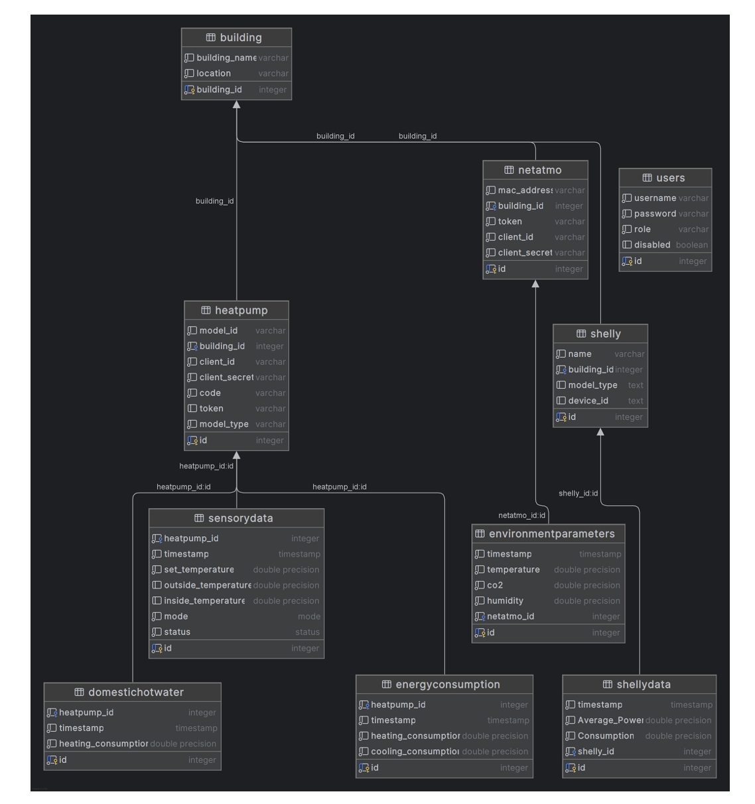

## **General Information and Purpose**

**TE ID & Name:** TE-12 - Enhancing Comfort, Energy & Performance (Co-designed Value-Added Services for Comfort, Energy & Performance Optimisation)

**Description and purpose:** TE-12 supports the **co-design, modelling and delivery of data-driven value-added services** for electrified ready buildings, focusing on **user comfort, energy efficiency and overall building performance**.

The service framework combines **structured co-creation methodologies with end-users** (Task 4.2), **behaviour-aware analytics and optimisation strategies** (Task 4.3.2), and **AI-assisted modelling of comfort-energy-performance trade-offs**. Its objective is to translate **user needs and preferences** into actionable optimisation strategies, delivered through adaptive services such as **personalised feedback, recommendations, notifications and performance insights**.

These services are continuously refined based on **user feedback** and **monitored building performance**, ensuring relevance, usability and acceptance across different pilots and contexts. Initial service concepts and mock-ups were validated in **D4.1**, with refinements and integration progress reported in **D4.2** and final maturation foreseen in **D4.3**.

**Lead partner/Contact Information:**

- Lead (TE-12): **ICCS**
- Key contributors: **HOLISTIC, INETUM**
- Supporting partners: **ED, CARTIF, EURAC, Blueprint, IDM, UNIZAG, ZENITH, VEOLIA**, and others per pilot

**Target Front Runners/Pilots:** **Multiple Front Runners across WP5**, with services adapted per **building type, use case and user group**. Initial focus is on pilots with available **user engagement activities** and **monitoring infrastructure**.

**Architecture Diagram:**

TE-12 provides a service-oriented framework for turning pilot data, behavioural insights and co-design inputs into **advisory services** that help users and stakeholders understand and improve building comfort, energy use and performance. In practical terms, it operates as a layer above monitoring and interoperability components, consuming data and producing **recommendations, indicators and engagement-oriented outputs** rather than direct control actions.

The TE combines the following building blocks:

1. **Co-Design & User Engagement Layer**
   - Structured workshops and co-creation activities with end-users
   - Service concept mapping per pilot, building type and user group
   - Translation of user needs into service requirements and feedback loops

2. **Analytics & Modelling Layer**
   - Behaviour-aware analytics for comfort preferences and usage patterns
   - Energy and performance assessment using pilot data
   - AI-assisted modelling of comfort-energy-performance trade-offs

3. **Service Logic Layer**
   - Recommendation generation
   - Personalised feedback and notifications
   - Performance insight generation
   - Tracking of comfort, energy and environmental goals

4. **Integration Layer**
   - Data ingestion through WP4 interoperability mechanisms
   - Integration with dashboards and web-based visualisations
   - Optional export of analytics results to other WP4 services

5. **Consumer Layer**
   - Building users and occupants
   - Pilot operators and technical partners
   - Dashboards, reporting tools and advisory services
   - Other WP4 TEs consuming analytics outputs at advisory level

## **Functional Requirements**

Describe the core capabilities of the TE and the functions it provides.  
Focus on what the TE does, not how it is implemented.

- **Service Co-Design & Mapping:** Identify and structure value-added services per pilot and use case, and map them to available data, technologies and user needs.
- **User-Centric Analytics:** Model occupant behaviour, comfort preferences and usage patterns, and analyse energy consumption and building performance indicators.
- **Optimisation Strategy Support:** Identify trade-offs between comfort, energy use, carbon footprint and performance, and generate optimisation recommendations that reflect user preferences.
- **Feedback & Engagement Mechanisms:** Provide personalised notifications, insights and recommendations, and support social and environmental goal tracking such as energy savings and emissions awareness.
- **Iterative Service Improvement:** Continuously refine services based on user feedback, pilot results and co-creation loops between users and technical partners.
- **Advisory Output Generation:** Produce non-control outputs such as recommendations, trends, performance summaries and service insights for dashboards and decision support.
- **Cross-TE Advisory Support:** Optionally provide analytics outputs to other WP4 services through the common interoperability framework.

## **Non-Functional Requirements**

- **Performance:**
  - Near-real-time analytics are **not required**.
  - **Batch or periodic processing** is sufficient, depending on the service (**hourly / daily / weekly**).
  - Response times should be suitable for **dashboards and advisory feedback**, typically in the range of **seconds to minutes**.
- **Reliability and Availability:**
  - Designed for **non-critical advisory services** rather than hard real-time control.
  - Services remain functional even with **partial or delayed data**.
  - Supports **graceful degradation** when data streams are incomplete.
- **Security (authentication, authorisation, data encryption, data privacy):**
  - **Authentication:** Access controlled via project-level authentication mechanisms.
  - **Authorisation:** Read-only access to operational data unless explicitly authorised otherwise.
  - **Privacy:** No personal data processing beyond aggregated or pseudonymised user inputs.
  - **Compliance:** GDPR-compliant by design.

## **Service Interfaces**

#### **Logical Interfaces**

- Interfaces are exposed as **logical service endpoints** rather than real-time control APIs.
- Integration is provided via:
  - **dashboards**
  - **web-based visualisations**
  - **data exchange through the WP4 interoperability layer**

#### **Interaction Modes**

- **Advisory outputs** (recommendations, insights)
- **Visual feedback** (charts, indicators, trends)
- **Optional export of analytics results** to other WP4 services

#### **API Endpoints**

For each exposed endpoint:

- Request Parameters
- Request Example
- Response Parameters
- Response Example
- Error Handling

<table><tbody><tr><th>
<strong>Endpoint 1</strong>
</th><th>
<strong>Devices Information</strong>
</th></tr><tr><td>
<strong>Url</strong>
</td><td>
/devices/{device_type}/data/
</td></tr><tr><td>
<strong>Method</strong>
</td><td>
GET
</td></tr><tr><td>
<strong>Description</strong>
</td><td>
Retrieves device information from the META-BUILD database. Supported device types include Netatmo, Shelly and Heat Pump, returning the corresponding registered devices.
</td></tr><tr><td>
<strong>Headers</strong>
</td><td><ul><li>Authorization: Basic Auth</li></ul></td></tr><tr><td>
<strong>Request Parameters</strong>
</td><td><ul><li>device_type (path, required): Device type, e.g. "netatmo", "shelly" or "heatpump"</li></ul></td></tr><tr><td>
<strong>Request</strong> <strong>Example</strong>
</td><td>
Example requests.get(url, auth=HTTPBasicAuth(username, password))
</td></tr><tr><td>
<strong>Response Parameters</strong>
</td><td><ul><li>id (int): Internal device identifier</li><li>mac_address (string): Device MAC address</li><li>building_id (int): Associated building identifier</li><li>token (string): Access token where applicable</li><li>client_id (string): Client identifier where applicable</li><li>client_secret (string): Client secret where applicable</li></ul></td></tr><tr><td>
<strong>Response</strong> <strong>Example</strong>
</td><td>
Example { "netatmo_devices": [ { "id": 1, "mac_address": "70:ee:50:56:67:0e", "building_id": 3, "token": "token", "client_id": "client id", "client_secret": "client secret" } ] }
</td></tr><tr><td>
<strong>Error Handling</strong>
</td><td><ul><li>401 Unauthorized</li><li>422 Unprocessable Entity</li></ul></td></tr></tbody></table>

<table><tbody><tr><th>
<strong>Endpoint 2</strong>
</th><th>
<strong>Netatmo Historical Data</strong>
</th></tr><tr><td>
<strong>Url</strong>
</td><td>
/netatmomodel/{netatmo_id}/data/
</td></tr><tr><td>
<strong>Method</strong>
</td><td>
GET
</td></tr><tr><td>
<strong>Description</strong>
</td><td>
Retrieves historical data from a Netatmo device for a specified period in UTC timezone.
</td></tr><tr><td>
<strong>Headers</strong>
</td><td><ul><li>Authorization: Basic Auth</li></ul></td></tr><tr><td>
<strong>Request Parameters</strong>
</td><td><ul><li>netatmo_id (path, required): Netatmo device identifier</li><li>start (query, required): Start timestamp, e.g. "2025-07-01T00:00:00"</li><li>end (query, required): End timestamp, e.g. "2025-07-03T00:00:00"</li></ul></td></tr><tr><td>
<strong>Request</strong> <strong>Example</strong>
</td><td>
Example requests.get(url, auth=HTTPBasicAuth(username, password), params=params)
</td></tr><tr><td>
<strong>Response Parameters</strong>
</td><td><ul><li>temperature (float)</li><li>co2 (float)</li><li>humidity (float)</li></ul></td></tr><tr><td>
<strong>Response</strong> <strong>Example</strong>
</td><td>
Example { "2025-07-01T01:54:11": {"temperature": 27.6, "co2": 887.0, "humidity": 54.0}, "2025-07-01T03:55:28": {"temperature": 27.6, "co2": 1035.0, "humidity": 54.0}, "2025-07-01T04:56:07": {"temperature": 27.6, "co2": 1100.0, "humidity": 55.0} }
</td></tr><tr><td>
<strong>Error Handling</strong>
</td><td><ul><li>401 Unauthorized</li><li>422 Unprocessable Entity</li></ul></td></tr></tbody></table>

<table><tbody><tr><th>
<strong>Endpoint 3</strong>
</th><th>
<strong>Shelly Historical Data</strong>
</th></tr><tr><td>
<strong>Url</strong>
</td><td>
/shelly/data/shellyid/{shelly_id}
</td></tr><tr><td>
<strong>Method</strong>
</td><td>
GET
</td></tr><tr><td>
<strong>Description</strong>
</td><td>
Retrieves historical data from a Shelly meter for a specified period.
</td></tr><tr><td>
<strong>Headers</strong>
</td><td><ul><li>Authorization: Basic Auth</li></ul></td></tr><tr><td>
<strong>Request Parameters</strong>
</td><td><ul><li>shelly_id (path, required): Shelly device identifier</li><li>start_date (query, required): Start date, e.g. "2025-07-01"</li><li>end_date (query, required): End date, e.g. "2025-07-03"</li></ul></td></tr><tr><td>
<strong>Request</strong> <strong>Example</strong>
</td><td>
Example requests.get(url, auth=HTTPBasicAuth(username, password), params=params)
</td></tr><tr><td>
<strong>Response Parameters</strong>
</td><td><ul><li>timestamp (datetime)</li><li>consumption (float)</li><li>avgPower (float)</li></ul></td></tr><tr><td>
<strong>Response</strong> <strong>Example</strong>
</td><td>
Example [ { "timestamp": "01-07-2025 00:00", "consumption": 0.14, "avgPower": 584.08 } ]
</td></tr><tr><td>
<strong>Error Handling</strong>
</td><td><ul><li>401 Unauthorized</li><li>422 Unprocessable Entity</li></ul></td></tr></tbody></table>

<table><tbody><tr><th>
<strong>Endpoint 4</strong>
</th><th>
<strong>Heat Pump Historical Data</strong>
</th></tr><tr><td>
<strong>Url</strong>
</td><td>
/heatpumpmodel/{heatpump_id}/data/{table}
</td></tr><tr><td>
<strong>Method</strong>
</td><td>
GET
</td></tr><tr><td>
<strong>Description</strong>
</td><td>
Retrieves heat pump data for a specified period. Supported tables include energy consumption, domestic hot water and sensory data.
</td></tr><tr><td>
<strong>Headers</strong>
</td><td><ul><li>Authorization: Basic Auth</li></ul></td></tr><tr><td>
<strong>Request Parameters</strong>
</td><td><ul><li>heatpump_id (path, required): Heat pump identifier</li><li>table (path, required): Dataset to retrieve, e.g. "energyconsumption", "dhw" or "sensorydata"</li><li>start_date (query, optional): Start date, e.g. "2025-07-01"</li><li>end_date (query, optional): End date, e.g. "2025-07-03"</li><li>start (query, optional): Start timestamp, e.g. "2025-07-01T00:00:00"</li><li>end (query, optional): End timestamp, e.g. "2025-07-03T00:00:00"</li></ul></td></tr><tr><td>
<strong>Request</strong> <strong>Example</strong>
</td><td>
Example requests.get(url, auth=HTTPBasicAuth(username, password), params=params)
</td></tr><tr><td>
<strong>Response Parameters</strong>
</td><td><ul><li>timestamp (datetime)</li><li>heating_consumption (float, optional)</li><li>cooling_consumption (float, optional)</li><li>consumption_sum (float, optional)</li><li>set_temperature (float, optional)</li><li>outside_temperature (float, optional)</li><li>inside_temperature (float, optional)</li><li>mode (string, optional)</li><li>status (string, optional)</li></ul></td></tr><tr><td>
<strong>Response</strong> <strong>Example</strong>
</td><td>
Response example for energy consumption: { "2025-07-01T02:00:00": {"heating_consumption": 0.0, "cooling_consumption": 0.0, "consumption_sum": 0} }  Response example for domestic hot water: { "2025-07-01T02:00:00": {"heating_consumption": 0.0} }  Response example for sensory data: { "2025-07-01T01:00:05.345060": {"set_temperature": 28.0, "outside_temperature": 28.0, "inside_temperature": 28.9, "mode": "heating", "status": "off"} }
</td></tr><tr><td>
<strong>Error Handling</strong>
</td><td><ul><li>401 Unauthorized</li><li>422 Unprocessable Entity</li></ul></td></tr></tbody></table>

#### **UI Mockups (if applicable)**

- **Service dashboard view:** Displays comfort, energy and performance indicators, together with recommendations, trends and user-facing insights.
- **Advisory feedback view:** Highlights personalised suggestions, notifications and engagement-oriented messages.
- **Pilot analytics view:** Summarises building-level patterns, performance indicators and service outcomes for technical partners.

## **Data Model**

- **Entities and relationships:**
  - **Building / Pilot**(building_id, pilot_id)
  - **UserProfile**(profile_id, aggregated_preferences, priorities, no personal identifiers)
  - **ComfortIndicator**(indicator_id, building_id, type, value, timestamp)
  - **EnergyPerformanceMetric**(metric_id, building_id, type, value, timestamp)
  - **OptimisationRecommendation**(recommendation_id, building_id, linked_state, linked_preferences, message, priority)

- **Relationships:**
  - A **Building** hosts multiple services
  - Services consume **performance** and **comfort indicators**
  - **Recommendations** are linked to both **system state** and **user preferences**
  - Analytics outputs may be linked to dashboards and optionally to other WP4 services

- **Database schema (logical):**
  - buildings: {building_id, pilot_id, type, metadata}
  - user_profiles: {profile_id, building_id, aggregated_preferences, priorities, update_ts}
  - comfort_indicators: {indicator_id, building_id, category, value, unit, timestamp}
  - energy_metrics: {metric_id, building_id, category, value, unit, timestamp}
  - behavioural_patterns: {pattern_id, building_id, pattern_type, summary, period}
  - recommendations: {recommendation_id, building_id, related_indicator_id, related_profile_id, message, priority, created_at}
  - analytics_outputs: {output_id, building_id, service_type, summary, timestamp}
 

## **Data Requirements**

Where data is unavailable, **simulated or assumed values** may be used for **design-phase validation**.

| Data Category | Data Description | Source Type | Temporal Granularity | Spatial Scope | Historical Depth | Access Mode |
| --- | --- | --- | --- | --- | --- | --- |
| Indoor Comfort Metrics | Temperature, IAQ indicators | BMS / Sensors (via WP4) | Hourly | Building / Zone | As available | Read-only |
| Energy Consumption | Electricity / thermal use | Monitoring systems | Hourly | Building / Asset | As available | Read-only |
| User Preferences | Comfort ranges, priorities | Co-design workshops / UI | On change | User / Building | Not required | Read-only |
| Behavioural Patterns | Occupancy / usage trends | Derived analytics | Daily / weekly | Building / User group | Rolling analytical horizon | Read-only |
| Performance Indicators | Energy and comfort KPIs | Analytics layer | Daily | Building / Service | As generated | Read-only |

## **Integration and Dependencies**

- **External dependencies:** User engagement and co-design inputs; pilot data availability; building monitoring readiness.
- **System dependencies:** WP4 interoperability framework; analytics and visualisation components; pilot monitoring infrastructure.
- **Third-party integrations:** Compatibility with **ED data connectors**, dashboards and pilot-specific service interfaces where applicable.
- **Edge/Cloud integration:** TE-12 operates primarily as an **advisory and analytics layer**, consuming monitored data and exposing outputs through dashboards and service interfaces rather than direct edge control.
- **Data space integration:** Data exchange is aligned with **common information models** and the WP4 interoperability framework.

**Dependencies:**

- **WP4 interoperability framework (T4.1)**
- **Monitoring and data access from WP5 pilots**
- **Input from co-design activities (Task 4.2)**

**Integration points:**

- Interfaces with **optimisation and control services** at **advisory level**
- Data exchange aligned with common information models
- Compatibility with **ED data connectors** and dashboards

## **Security and Privacy**

- **Data Sensitivity:** Operational and aggregated building data, comfort indicators, energy metrics and user preference abstractions.
- **Access Control:** Secure access via project authentication mechanisms.
- **Privacy:** Pseudonymisation applied where user-related data exists; no direct personal data processing beyond aggregated or pseudonymised inputs.
- **Control Scope:** TE-12 does **not perform direct actuation or control**.
- **Compliance:** GDPR-compliant by design.

## **Current Status**

This section summarises the current maturity of TE-12, focusing on service definition, pilot analytics and advisory-service readiness.

**Status:**

- Service concepts and mappings have been defined through **literature review** and **co-design workshops**
- Initial **mock-ups** and **service descriptions** have been produced
- **Behaviour-aware analytics** have been tested on selected pilot datasets

**Validation:**

- Validation so far has focused on **offline and exploratory analytics** using pilot data
- No full real-time deployment is required at this stage

**Limitations:**

- Data availability varies significantly across pilots
- Some services rely on **assumed or simulated behavioural data**
- Full integration depends on **WP5 pilot readiness**

## **Next Steps**

Concrete actions toward the next maturation stage:

1. **Refine optimisation strategies per pilot**, taking into account building type, user needs and data availability.
2. **Strengthen links with control-oriented TEs**, especially where advisory analytics can support optimisation and flexibility services.
3. **Finalise UI integration and feedback mechanisms** for dashboards and service-facing visualisations.
4. **Consolidate results across pilots** to support exploitation, replication and final service packaging.
